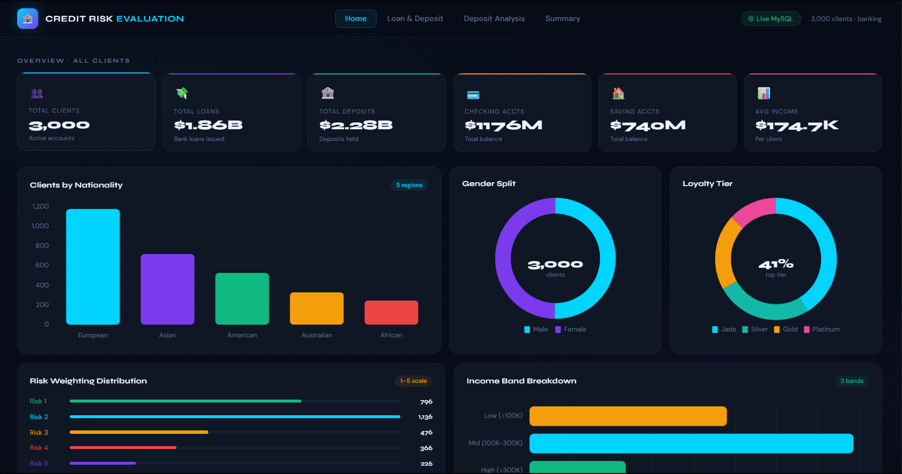
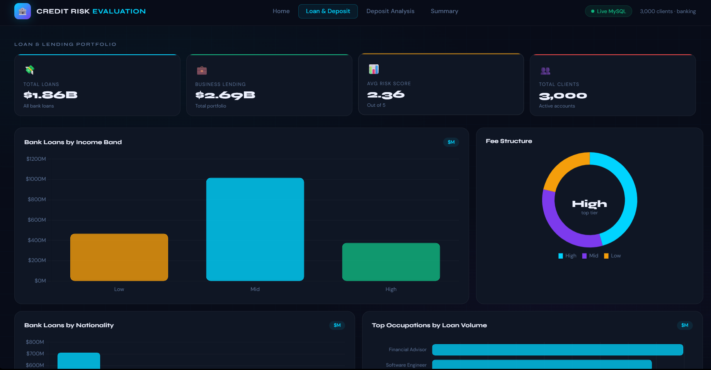
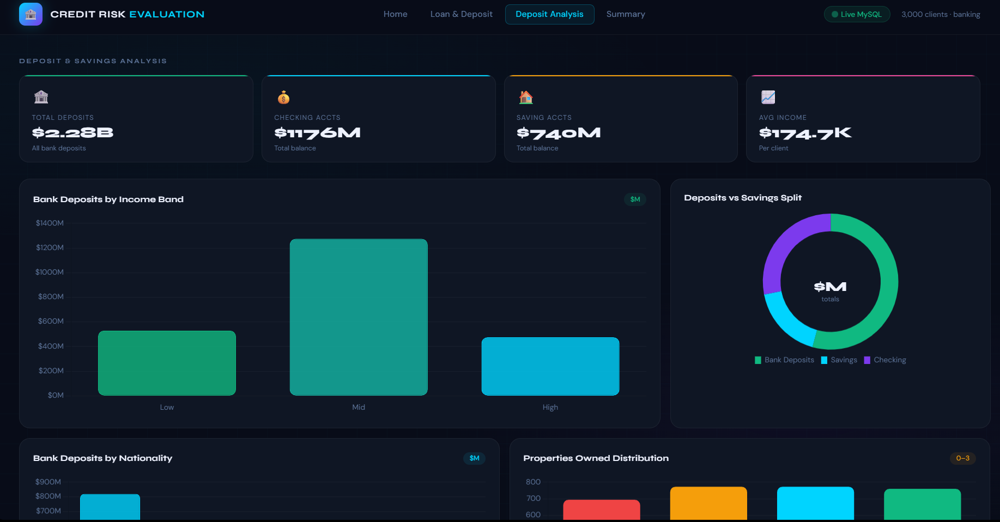
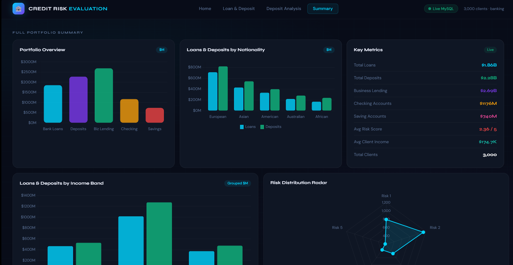

# 🏦 Credit Risk Evaluation — Interactive Dashboard

> A live, dark-themed web dashboard built with **Flask** and **MySQL** that visualises credit risk, loan portfolios, and client demographics in real time — the visual front-end companion to the [Credit Risk Evaluation](https://github.com/manoj-s-7/Credit-Risk-Evaluation) analysis project.

---

## 📸 Preview

### Home — Client Overview


### Loan & Deposit Portfolio


### Deposit Analysis


### Portfolio Summary


---

## ✨ Features

- **Live MySQL Connection** — all charts are fetched fresh from the database on every page load; no stale static files
- **4-Page Navigation** — Home, Loan & Deposit, Deposit Analysis, and Summary, each with its own KPI strip and chart set
- **8+ KPI Cards** — Total Clients, Total Loans ($B), Total Deposits ($B), Checking & Saving balances, Business Lending, Avg Income, and Avg Risk Score
- **Rich Chart Library** — bar charts, donut charts, horizontal bar charts, radar chart, and a full portfolio breakdown
- **Dark UI** — sleek dark theme with color-coded risk and loyalty tiers
- **Zero Refresh Latency** — data loads via a single `/api/data` JSON endpoint, keeping the UI snappy

---

## 📊 Dashboard Pages

| Page | KPIs | Charts |
|---|---|---|
| **Home** | Total Clients, Loans, Deposits, Checking, Saving, Avg Income | Clients by Nationality, Gender Split, Loyalty Tier, Risk Weighting Distribution, Income Band Breakdown |
| **Loan & Deposit** | Total Loans, Business Lending, Avg Risk Score, Total Clients | Bank Loans by Income Band, Fee Structure, Loans by Nationality, Top Occupations by Loan Volume |
| **Deposit Analysis** | Total Deposits, Saving Accounts, Checking Accounts, Avg Deposits | Deposits by Income Band, Deposits by Nationality, Properties Owned, Savings vs Checking split |
| **Summary** | Full portfolio totals | Portfolio overview radar, grouped nationality/income comparisons, combined loan & deposit breakdown |

---

## 🗂️ Project Structure

```
credit-risk-analysis-Dashboard/
├── app.py               # Flask backend — MySQL queries & /api/data endpoint
├── requirements.txt     # Python dependencies
├── templates/
│   └── index.html       # Frontend dashboard (Chart.js, served by Flask)
├── assets/              # Dashboard preview screenshots
│   ├── home_Page.png
│   ├── loan_Deposit.png
│   ├── deposit_analysics.png
│   └── summary.png
└── README.md
```

---

## 🚀 Getting Started

### Prerequisites

- Python 3.8+
- MySQL running locally with a `banking` database loaded
  *(see the [Credit Risk Evaluation](https://github.com/manoj-s-7/Credit-Risk-Evaluation) repo for the dataset and schema)*

### 1. Clone the repository

```bash
git clone https://github.com/manoj-s-7/credit-risk-analysis-Dashboard.git
cd credit-risk-analysis-Dashboard
```

### 2. Install dependencies

```bash
pip install -r requirements.txt
```

### 3. Configure your database credentials

Open `app.py` and update the `DB_CONFIG` block near the top:

```python
DB_CONFIG = {
    "host":     "localhost",
    "port":     3306,
    "user":     "root",
    "password": "YOUR_PASSWORD_HERE",   # ← change this
    "database": "banking"
}
```

### 4. Run the app

```bash
python app.py
```

You should see:

```
🏦 Credit Risk Dashboard running at http://localhost:5000
```

### 5. Open in your browser

Navigate to **[http://localhost:5000](http://localhost:5000)**

---

## 🛠️ Tech Stack

| Layer | Technology |
|---|---|
| Backend | Python · Flask |
| Database | MySQL · mysql-connector-python |
| Frontend | HTML5 · CSS3 · Chart.js |
| Data API | Flask `/api/data` JSON endpoint |

---

## 🔗 Related Repository

This dashboard is the visual layer on top of the full analysis pipeline. For the data preprocessing, EDA, and credit risk modelling work, see:

👉 **[manoj-s-7/Credit-Risk-Evaluation](https://github.com/manoj-s-7/Credit-Risk-Evaluation)**
 ---

## 👨‍💻 Developed By

- **Manoj S**  
  GitHub: https://github.com/manoj-s-7

- **Manthan**  
  GitHub: https://github.com/manthan-x712

---